# Investment-Portfolio-Visualization-and-recommendation
*Python*
*Data Visualization, Web Scraping, data analysis, APIs.*

For this project, I picked Yahoo Finance as my main data source. The purpose of this project is to extract data (utilize API and web-scraping) from live sources and present the results. As a result, I build an user interactive investment program. Related News and Workplace ratings will be extracted to support the analysis. 

Download the requirements.txt file and have it installed on your PC.

## What is the Stock Price? 
After you start the program, you will be prompt to enter the tickers of the stocks you are interested in. 
Test Result:
> Which stock do you want to look into today?(Please enter a valid Ticker Symbol, enter done to proceed to next section  
> tsla  
> TSLA Current Price: 2,049.98 Fifty-Two weeks low: 211.54  Fifty-Two weeks high:2,095.49  

You can enter as many you want

> Which stock do you want to look into today?(Please enter a valid Ticker Symbol, enter done to proceed to next section  
> ba  
> BA Current Price: 167.50 Fifty-Two weeks low: 89.00  Fifty-Two weeks high:391.00  

## Some Visualization
I found interactive plot more accurately depict stock price. I mainly used Matplotlib. 

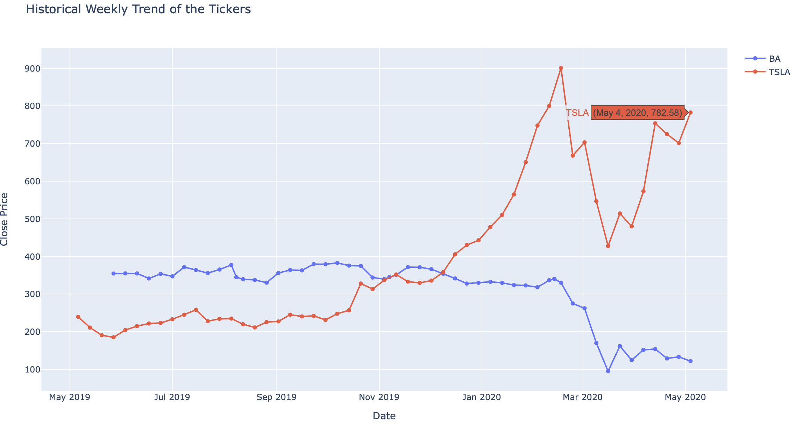

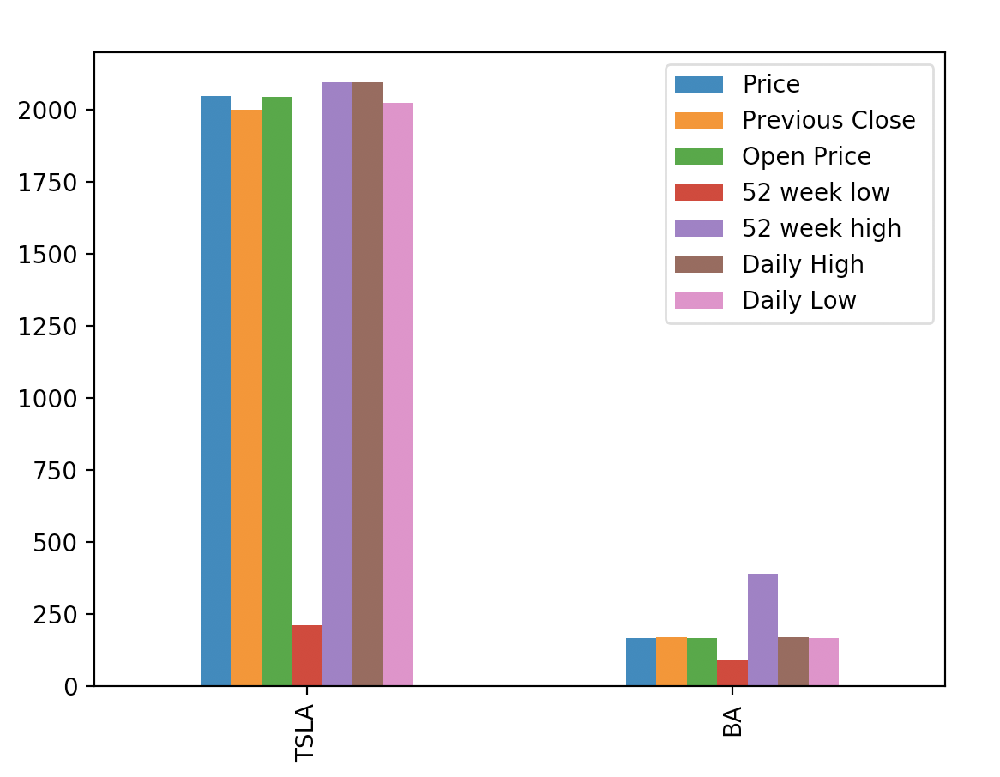

## Recommendation Based on your risk vulnerability 
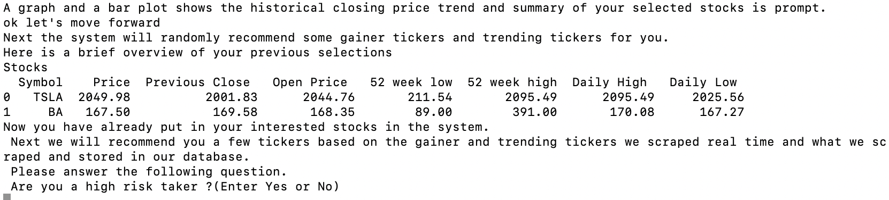

 

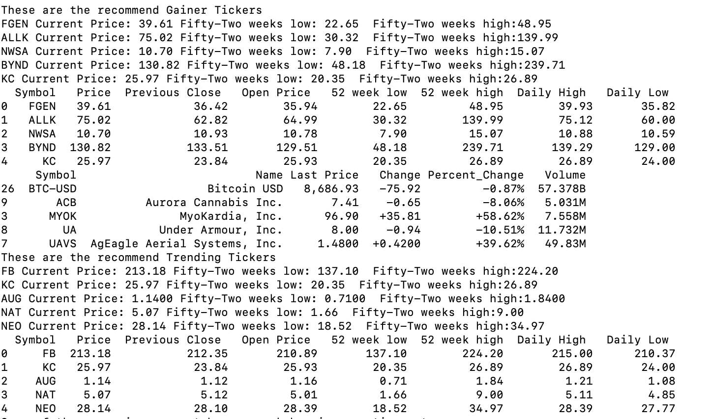

Trends on picked gainer,trending stocks

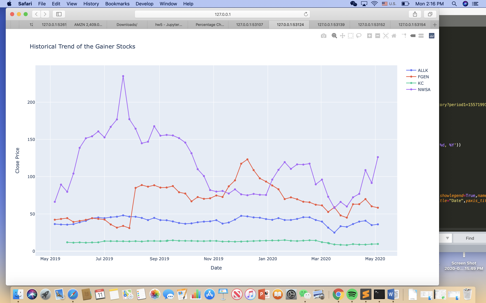

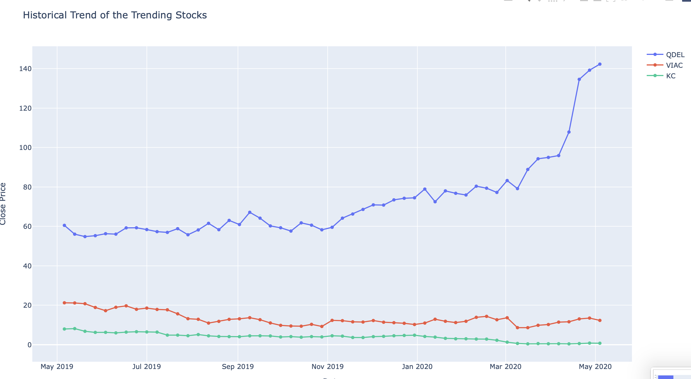

MORE EXAMPLE CAN BE FOUND IN THE IMAGE FOLDER

## News and Indeed Ratings
Use API to get access to New York Times data. Get the most recent news articles regarding the interested stocks. 
1. example using BABA,TWTR,FB,AMZN,TSLA

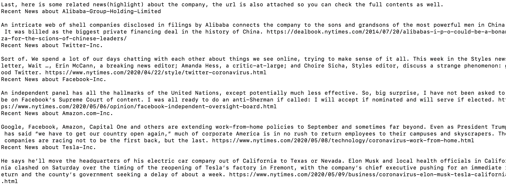

2. example using PYPL,BABA,FB

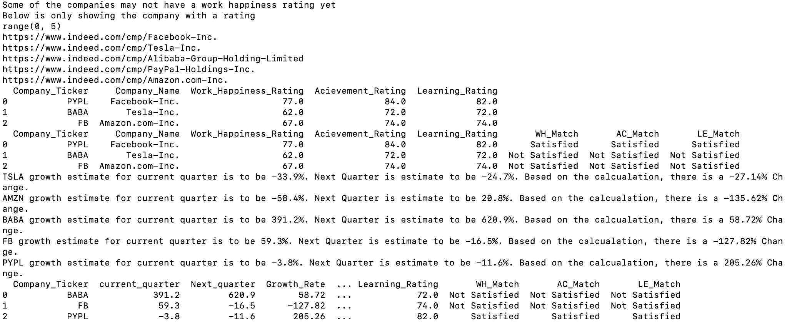

3. Work happiness,indeed rating
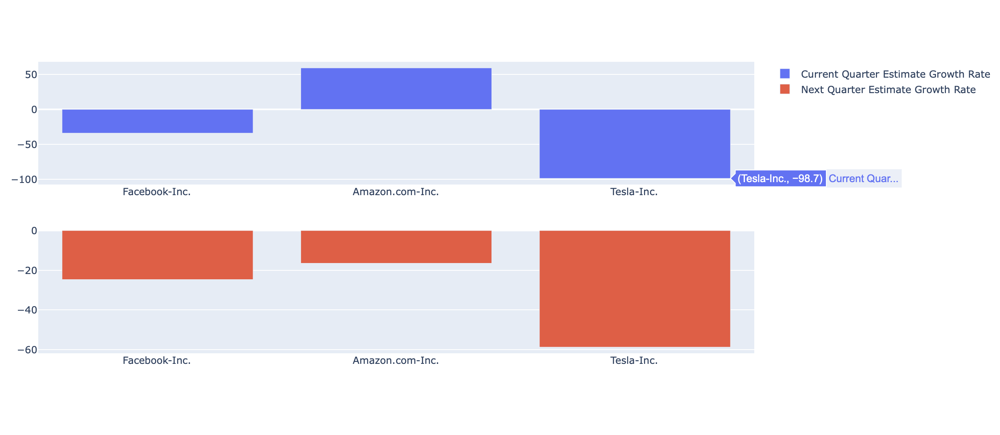

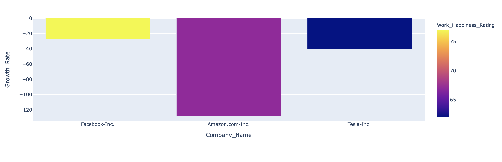

## Flowchart walkthrough

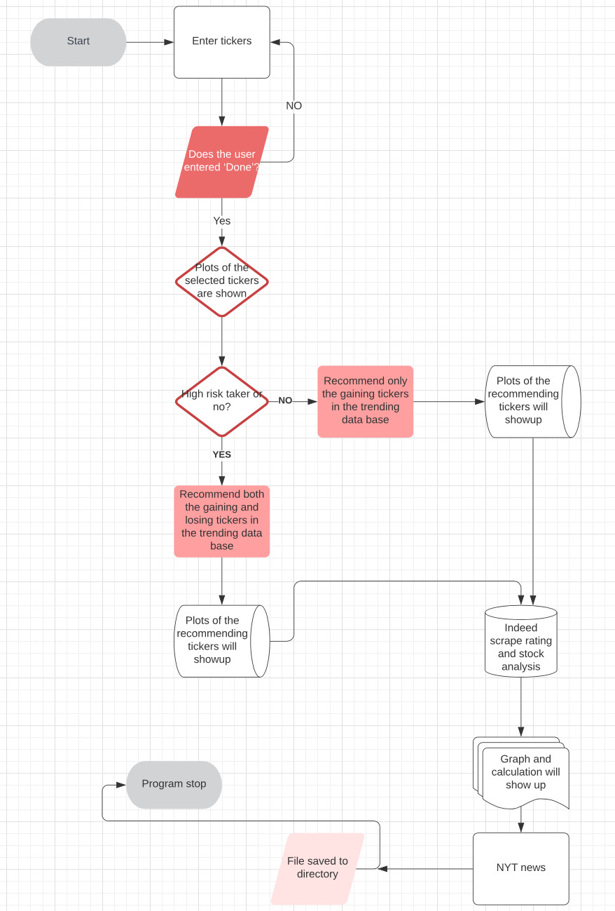

